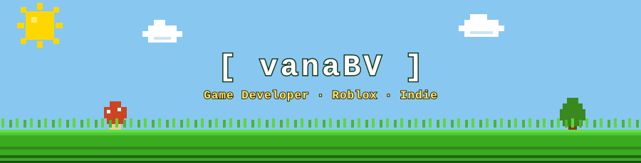

<p align="center">
  
</p>

<br>

<p align="center">
  <a href="https://vanabv.github.io">
    
  </a>
  &nbsp;
  <a href="https://vanabv.github.io/blog/">
    
  </a>
</p>

<p align="center">
  
</p>

---

### 👾 Interactive Web Portfolio & Review Log

> 🌐 **Live Website**: [https://vanabv.github.io](https://vanabv.github.io)  
> - vana's personal website
> - **🪙 10-Coin Easter Egg**
> - **📝 Game Review Log**
> - **🗃️ Personal Archive**: I LOVE KEIBAAAA!!!!!!!!!

---

### 🎮 About

```
▶  게임 만드는 기획자 (안서진 / vanaBV)
▶  로블록스 택티컬 FPS 게임 제작중
▶  인디게임 기획, 3D 뷰모델 & 시스템 개발
```

### 🕹️ Now Playing / Projects

| 프로젝트 | 설명 | 플랫폼 | 상태 |
|---|---|---|---|
| [Xrunners](https://github.com/vanaBV/Xrunners) | Roblox Tactical FPS (로비 시스템 & 무기 뷰모델) | Roblox / TS | `🔨 개발 중` |
| [WALLRUNNING OBBY](https://www.roblox.com/share?code=5d6bfd0da560414db35498116fe1d37d&type=ExperienceDetails&stamp=1747768098406) | 월러닝 물리 판정 파쿠르 오비 | Roblox Studio | `✅ 서비스 중` |
| [vanabv.github.io](https://vanabv.github.io) | 레트로 픽셀 포트폴리오 & 게임 리뷰 블로그 | Web (HTML/CSS/JS) | `✅ 배포 완료` |

### 🛠️ Stack


### 📊 Stats

<p align="center">
  
  &nbsp;
  
</p>

<br>

<p align="center">
  
</p>
